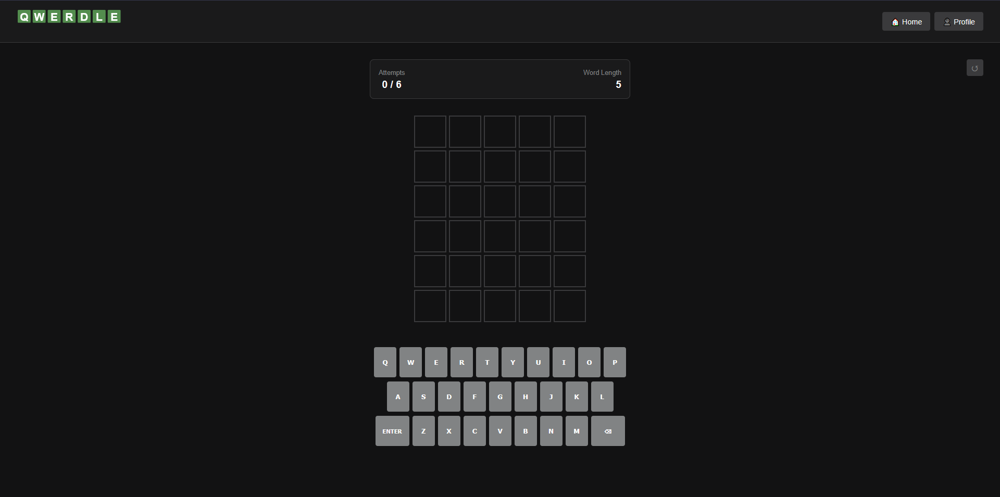

  

A scalable full-stack NYT Games Wordle clone built as a capstone project for the Java Enterprise career track at [CodingNomads](https://codingnomads.com/) with dictionary API integration, unlimited random games, daily words synced for all players, player profiles, and stat-tracking. 

  

---

## Features
- **Daily Games** — A scheduled API call at midnight every day populates the Word of the Day, which is cached server-side and shared for all players and can only be played once per user, win or lose.
- **Unlimited Random Games** — Play as many games as you would like in a day, with a random word pulled from a hardcoded list each time the game is generated—it doesn't even use a different endpoint from the daily games, only RequestParams.
- **User Authentication** — Registration, login, and session management via Spring Security with BCrypt password encoding stored in a server-side SQL database; games can even be played anonymously
- **Stat-Tracking** — A detailed user profile page that keeps score for you, remembering your wins, losses, and streaks
- **User Experience** — Gameplay as expected of a Wordle clone: 
  - color-coded feedback of guessed letters revealed with flipping tile animation
  - sleek, dark user interface
  - input letters using the onscreen keyboard or your own physical one
  - subtle restart button
  - confetti animation on correct guess and shaking screen effect on loss
  - consistent dashboard element for app navigation
- **Dictionary Validation** — Player guesses are validated against a third-party dictionary API in real time to prevent wasted attempts on typos or unexpected words
- **Persistent Game States** — Daily and random game states are maintained independently per session using Spring's SessionAttributes annotation, allowing players to switch between modes without losing progress, even persisting across anonymous play into login—so, if you forget to log in, you won't lose that sweet two-attempt victory or that edge-of-your-seat game-in-progress.

## Tech Stack
- **Backend** — Java 17, Spring Boot, Spring Security, Spring Data JPA
- **Frontend** — Thymeleaf, HTML/CSS, JavaScript
- **Database** — MySQL
- **Build Tool** — Gradle
- **External API** — [WordsAPI](https://www.wordsapi.com/) via RapidAPI
- **Deployment** — Tomcat 10 on AWS EC2: [play here!](https://www.qwerdle-app.com/)

---

| Home                         | Play                            | Profile                            |
|------------------------------|---------------------------------|------------------------------------|
|  |  |  |

---

## Future Plans

Qwerdle is custom-built to be scalable to a variety of word games built from the same base methods with minimal work mostly on the frontend; many methods and models are reusable and Qwerdle-specific controllers and services are named as such, with shared features stripped out to their own independent spaces; Dictionary API host and other application properties are easily switched out at one source with changes propagating across the app. 

As this is an ever-evolving project, it could see many new features and improvements:

- **Improvement:** Prevent guessing a word the user has already submitted. ***High Priority***
- **Improvement:** Keep track of words the user has already played games for, and prevent them from being seen again until all other available words are exhausted. Similarly, prevent the Word of the Day from repeating itself, at least in a close timeframe. ***High Priority***
- **Improvement:** Expand hardcoded word list to include more words; potentially categorize by word difficulty and implement lists of longer words for future purposes
- **Improvement:** Separate random and daily game stat-tracking
- **Improvement:** Deepen stat-tracking to save not just results but entire gameboards. ***Low Priority***
- **Feature:** Hint button that pulls the answer's definition from the dictionary API and displays it to the user, perhaps at the cost of one guess
- **Feature:** User-configurable difficulty settings, such as amount of attempts and word length; perhaps implement as discrete modes
- **Feature:** Button for users to share their stats with other users
- **Feature:** Ability for users to upload their own profile picture; would require external tools to verify safety of images. ***Low Priority***
- **Feature:** Entire new word game with separate tracking such as Hangman or a dynamic crossword

---